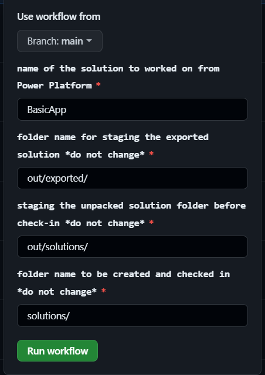

GitHub Actions for Power Platform Deployment
This repository hosts reusable GitHub Actions workflows that streamline the deployment of Power Platform solutions. 
Considerations include:
Utilizing reusable workflows to allow multiple teams/repositories to get concurrent updates/hotfixes
Secrets & multiple environments
Storing PowerApp in releases for easy rollbacks

The deployment process is achieved in four simple steps:

Step 1: Generate and Add Power App Secrets for Each Environment
Firstly, you need to create necessary secrets and credentials for Power Apps in your Power Platform. These secrets must be added to each environment (i.e., development, build, and production) in your GitHub repository secrets. The required secrets are:

CLIENT_SECRET: The secret value for authentication using Service Principal Name (SPN).
ENVIRONMENT_URL: The URL of the environment.
CLIENT_ID: The client id for your application.
TENANT_ID: The tenant id for your application.
The provision of these secrets ensures secure authentication in Power Platform across all environments. Make sure to repeat this step for each of your environments.
Details: https://learn.microsoft.com/en-us/power-platform/alm/tutorials/github-actions-start

Step 2: Run the Export Action
The second step is to run the export-and-branch-solution action. This action exports a Power Platform solution from the development (DEV) environment, unpacks it, and then prepares, commits, and pushes a git branch with the changes. You can trigger this action via the workflow_call event. This action requires several input parameters and secrets to execute correctly.

Step 3: Create a Pull Request (PR)
Once the export-and-branch-solution action has run successfully and pushed the changes to a new branch, create a PR for these changes. This procedure facilitates code review and ensures adherence to best practices before the changes are merged into the main branch.

Step 4: Create a Release
The final step involves creating a new release on your GitHub repository. This action will automatically trigger the release-solution-to-prod-reusable workflow. This workflow converts the solution to managed status in the build Power Platform environment, uploads the solution to the GitHub artifacts, and deploys the solution to the production (PROD) environment.

Note: Always review the changes and understand fully the actions and workflows before creating a PR or a Release. It's a crucial practice for maintaining high standards of code integrity.

Areas to improve the solution:
These workflows offer a simplified process for managing the lifecycle of Power Platform solutions, but additional workflows that support rollback and verification would improve the quality of the template.
Additionally, adding gates to production environments would allow for approvers to ensure production is ready for deployment, and have time to verify the application in the build environment.